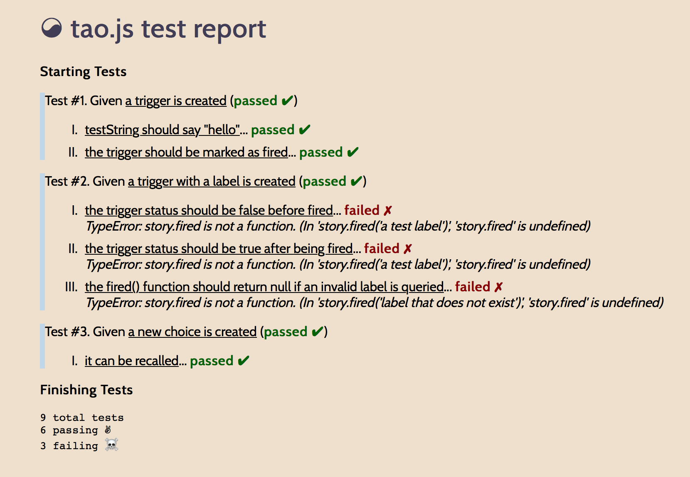
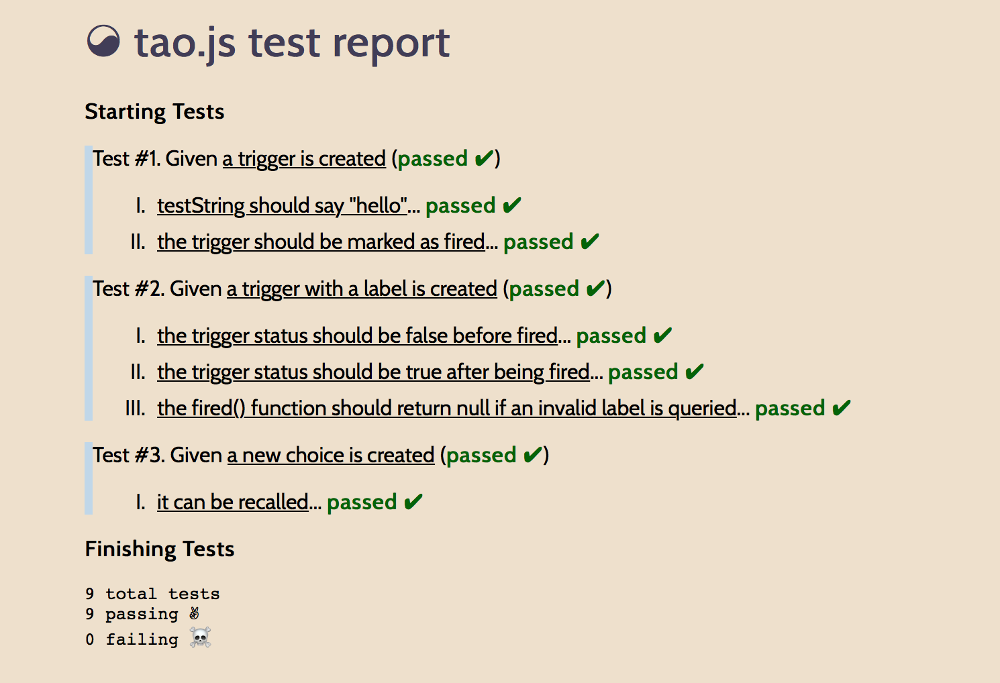
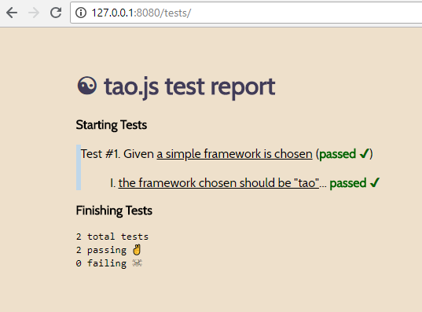

# ☯ tao.js
A tiny, pure JS testing tool with zero dependencies. Write your tests in plain english*, not some obfuscated computer speak. 

<div style="float: left; width: 49%; margin: 1%">
<center><h3>Turn This:</h3></center>
  
</div>
<div style="float: left; width: 49%; margin: 1%">
<center><h3>Into This:</h3></center>
  
</div>
<div style="clear:both"></div>

Tao stands out from other testing frameworks in the following ways:

* Tests are written semantically. This is the primary feature of Tao.
* Zero dependencies
* Extremely small

However, with great minimalism comes great caveats:

* A DOM is required since tests are ran and reported in a browser
* It does not include robust scaffolding tools for fixtures; you create all that yourself.
* It probably doesn't make sense for enterprise projects that have dozens of dependencies

If you advertise your project's small size as one of its core features, consider Tao for testing. 

## Quick Start

1. Include `tao.js` into an html file via local path or CDN.
2. Write your tests (see "Overview" below)
3. Run a local web server and navigate to your html file.

## Overview

There are two ways to include Tao testing in your project: through a **CDN**, or with a **folder**.

### CDN

Create an html file (ex: `tests.html`), and include the following between the `<head>` and `</head>` tags:

1. `<script src="https://gitcdn.link/repo/lawsonry/taojs/master/tests/tao.js"></script>`

2. `<script src="path/to/your-project-file.js">`

Then, add `<div id="tao"></div>` to your html file somewhere between the `<body>` and `</body>` tags.

Finally, either create a `<script>` tag to hold all your tests just before the `</body>` tag, or include your tests in an external file and include it in your testing file. (This is how the `tests/` folder in this repo is setup for you.)

### Folder

If you don't want to be reliant on an internet connection to the CDN link, that's okay. Just drop the `tests/` folder from the repo into your existing project.

Let's say your JavaScript project looks like this:

```
your-project/
    src/
        yourproject.js
    file1.js
    file2.html
    readme.md
```

Here's what you'll do to get up and running with tao.js: 

1. Drop the `tests/` folder into the root of your project.

2. Modify `tests/index.html` so that it calls your project file. The delivered `index.html` has placeholder text where your script needs to be. Replace `yourproject` with the name of your project file that is located in your `src/` folder--or, if you aren't using a `src/` folder, simply put the relative path to your file.

3. Write your tests.

# Writing Tests in Tao

Tao.js tests are all contained in a single object and follow a specific paradigm:

Given **<a condition>** by **<a function>**, well, **<an expectation>** because **<a function>**.

Tests are stored in an array, and each test follows a semantic format:

```
[{
    given: 'a condition',
    by: () => { someCondition() },
    then: [{
        well: 'an expectation',
        because: () => { someExpectation() }
    }]
}]
```

Here's an example of a basic type of test you can create: *given a single condition, assert an expectation*:

```js

var fixtureFunc = null

var tests = [
	{
    	given: 'a function that returns true',
        by: () => { 
            fixtureFunc = function() { return true } 
        },
        then: [{ 
                well: 'it should return true', 
                because: () => { return fixtureFunc() } 
            }]
    }
]
```

Each tests has exactly one `given`, `by`, and `then`, and each `then` can have up to 64,297,383 testable expectations.

| element | description |
|:------------  |:-----------------|
| given         | A string that defines the test group |
| by            | A function used to setup the test group variables. | 
| then          | The holder of all tests inside this test group.    |
| - well        | A string that defines a test in a test group.      |
| - because     | A function that must return either true or false. True means the test passes. | 

As a more detailed example, here's what the tests object would look like for three tests, where the first test has one part, the second tests has two parts, and the third tests has three parts: 

```js
[
	{
    	given: <string>,
        by: <function>,
        then: [
        	{ well: <string>, because: <function> }
        ]
    },
    {
    	given: <string>,
        by: <function>,
        then: [
        	{ well: <string>, because: <function> },
            { well: <string>, because: <function> }
        ]
    },
    {
    	given: <string>,
        by: <function>,
        then: [
        	{ well: <string>, because: <function> },
            { well: <string>, because: <function> },
            { well: <string>, because: <function> }
        ]
    },
```
            
Finally, here's a *"Hello, World!"* equivalent of the tao.js tests object:

```js
// tests/tests.js

// Test scaffolding variables
var frameworkChosen = ""

// Tests
var tests = [
	{
    	given: 'a simple framework is chosen',
        by: function() { 
        	frameworkChosen = "tao"
        },
        then: [
        	{
            	well: 'the framework chosen should be "tao"',
                because: function() {
                	return (frameworkChosen == "tao" ? true : false)
                }
            }
         ]
    }
]

// Run the tests
tao(tests)
```

If you spin up a web server (ex: `localhost:8080`) at your project root with the above `tests.js` file, your browser will show the following page when you navigate to `localhost:8080/tests/`:



## Example Projects

A good example of tao.js in the wild is [campfire.js](https://www.github.com/lawsonry/campfirejs). Check out the `tests/` folder there.

## Contributing 

Please feel free to help improve tao.js. Just keep in mind that the project is supposed to 1) be minimal, 2) get the job done as effortlessly as possible, and 3) be fun.